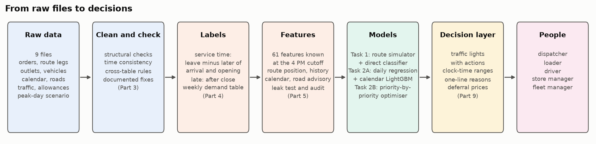

# Xora delivery analytics

**Tech-Triathlon 2026 — Datathon Challenge**  
**Team:** Xora | **Final Notebook:** `Xora_FinalNotebook.ipynb`

Waypoint Group runs 60 vehicles from two depots to 120 outlets across three retail brands. This repository delivers an end-to-end data science solution covering service duration estimation, route arrival lateness risk, 10-week multi-depot demand forecasting, and peak-day fleet allocation under constrained capacity.

| Task | Question | Output |
|---|---|---|
| Task 1 | How long will each delivery take at the outlet, and how likely is the truck to arrive after the window closes? | `submissions/submission_task1.csv` |
| Task 2A | How much volume (total and chilled) will each depot and brand need over the next 10 weeks? | `submissions/submission_task2a.csv` |
| Task 2B | On a peak day with vehicles in the workshop, which orders do we serve, on which truck, and which do we defer? | `submissions/submission_task2b.csv` and a written policy |

## Results at a glance

| Question | Waypoint today | Our approach | Result on data the models never saw |
|---|---|---|---|
| **Task 1.** How long will each delivery take? | published allowance table, off by 7.1 min a stop | LightGBM on cutoff-time features | **3.9 min** error a stop, **45% less** |
| **Task 1.** Will the truck arrive after the window closes? | slack on paper (log loss 0.287, AUC 0.86) | 1,000 replays of every route, blended with a direct classifier | **log loss 0.136, AUC 0.97**, calibrated |
| **Task 2A.** How much volume in the next 10 weeks? | same week last year | daily festival-aware models added up into ISO weeks | **5.2% error** on total, **3.6%** on chilled; **41 to 54% less error** than last year's pattern |
| **Task 2B.** Who gets served on a peak day? | dispatcher judgement | optimiser with a fixed, agreed order of priorities | **76 of 85 orders**, all 10 previous-run deferrals served (two-day service is not guaranteed; 4 deferred orders have 2 days and S1-078 requires splitting), chilled volume **within 0.2% of the proven maximum**, passes Waypoint's checker |
| **People.** What should each person do? | probabilities nobody reads | traffic lights, clock times and one-line reasons | the red stops are **21% of stops** but carry **over 80%** of expected late arrivals |

## Deliverables checklist

This table maps directly to the required Datathon deliverables in the Challenge Booklet (page 22):

| Booklet deliverable | File / Link | Description |
|---|---|---|
| **Architecture diagrams** | [`docs/figures/architecture_pipeline.png`](docs/figures/architecture_pipeline.png) | End-to-end data processing, feature engineering, and model pipeline |
| **Data preprocessing document** | [`docs/data_preprocessing.md`](docs/data_preprocessing.md) | Cleaning, label construction rationale, 4 PM cutoff feature audit, and model cards |
| **Model file(s)** | [`models/`](models/) | Serialised weights (`.pkl`) and model configurations in `manifest.json` |
| **Final notebook** | [`Xora_FinalNotebook.ipynb`](Xora_FinalNotebook.ipynb) | Complete CRISP-DM workflow from raw files to models, including Part 11 inference |
| **Peak-day allocation** | [`submissions/submission_task2b.csv`](submissions/submission_task2b.csv) | Validated allocation for scenario S1 (76 of 85 orders served) |
| **Peak-day policy** | [`docs/task2b_policy.md`](docs/task2b_policy.md) | Written policy with fleet analysis, calculations, and deferral shadow prices |
| **Prediction submissions** | [`submissions/submission_task1.csv`](submissions/submission_task1.csv)<br>[`submissions/submission_task2a.csv`](submissions/submission_task2a.csv) | Predictions formatted to match submission templates |
| **Demo video** | [YouTube walkthrough](https://youtu.be/WBJIwtG6Bjw) | Video explaining architecture, preprocessing, label construction, and decisions |
| **AI tool disclosure** | [`docs/ai_tool_disclosure.md`](docs/ai_tool_disclosure.md) | Full disclosure of AI-assisted vs human-authored work per competition rules |

## How to run

```bash
git clone https://github.com/sameera-ekanayaka/xora_datathon.git
cd xora_datathon
python -m venv .venv
source .venv/bin/activate          # on Windows: .venv\Scripts\activate
pip install -r requirements.txt
pip install -e .                   # makes the shared helpers in src/xora importable
```

Then unzip the competition datasets into `data/raw/` (see `data/README.md`) and run the notebooks in order, or run `Xora_FinalNotebook.ipynb` directly.

To verify the Task 2B allocation against Waypoint's feasibility rules:
```bash
python check_allocation.py submissions/submission_task2b.csv
```



## Notebook guide

Each notebook does one job and saves its results for the next one, so you can read them in order like chapters.

| # | Notebook | What it does |
|---|---|---|
| 01 | `notebooks/01_data_understanding.ipynb` | Profiles every file and shows what the data says about lateness, demand and the peak day |
| 02 | `notebooks/02_data_quality_and_cleaning.ipynb` | Checks every table against its expected rules, fixes what needs fixing and saves clean tables |
| 03 | `notebooks/03_label_construction.ipynb` | Builds the service-time and late labels for Task 1 and the weekly demand table for Task 2A |
| 04 | `notebooks/04_feature_engineering.ipynb` | Builds the Task 1 features from what a planner knows at the 4 PM cutoff, proves none of them leak, and audits each one |
| 05 | `notebooks/05_task1_service_and_lateness.ipynb` | Predicts service time and late risk by simulating each drafted route, compares it with a direct classifier, and writes the Task 1 predictions |
| 06 | `notebooks/06_task2a_demand_forecast.ipynb` | Forecasts daily demand and adds it up into ISO weeks so festival shifts are handled, with backtests and P10 to P90 ranges |
| 07 | `notebooks/07_task2b_peak_day_allocation.ipynb` | Plans the peak day with an optimiser that follows Waypoint's rules and a fixed order of priorities, prices every deferral, replays the plan on the clock and ranks workshop repairs |
| 08 | `notebooks/08_decision_layer.ipynb` | Turns the model outputs into plain instructions: a dispatcher risk board, driver run sheets, store messages, peak-day loading sheets and deferral notices, and a weekly reefer outlook |
| | `Xora_FinalNotebook.ipynb` | The whole story in one notebook: results at a glance, Parts 2 to 9 covering every stage above, how Waypoint would deploy and monitor it, and a final part that reloads the saved models and reproduces all three submissions |

## Repo layout

```
check_allocation.py   Task 2B allocation checker, unchanged
data/                 local only: raw data and processed tables
notebooks/            one notebook per stage, numbered in reading order
src/xora/             small shared helpers (paths, loading, time parsing, data checks)
models/               saved model files and manifest.json
submissions/          the three submission CSVs
docs/                 diagrams, data preprocessing document, Task 2B policy, AI tool disclosure
reports/              figures, feature audit, and decision layer artifacts
```

## Working practice

- `main` always runs. Work happens on a branch per stage and comes in through a pull request.
- Seeds are fixed and dependencies are pinned, so results reproduce.
